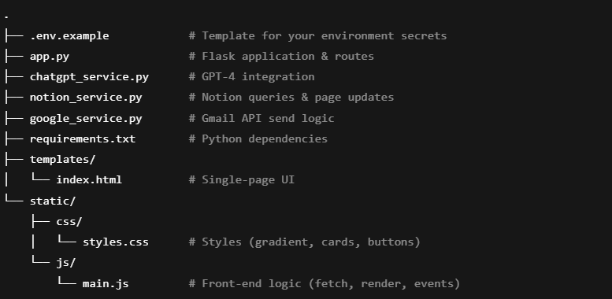

# IST341PF

# Automated Email Assistant

A lightweight Flask web app that automates email drafting, refinement, approval, and sending by integrating:

- **Notion API**: Stores your “to-do” email entries and tracks sent emails.
- **OpenAI GPT-4**: Generates professional email subject lines and bodies, and lets you iteratively refine them.
- **Gmail API**: Sends approved emails from your authorized Gmail account.
- **A modern single-page UI**: Three-step workflow (Draft → Refine → Approve & Send), live auto-refresh, and a “Sent Logs” dashboard.

---

## 📦 Features

1. **Fetch & Draft**  
   - Pull in all Notion pages whose **Status** ≠ Sent.  
   - One-click “Generate Draft” calls GPT-4 with your custom prompt.  
2. **Interactive Refinement**  
   - Chat-style textbox to fine-tune the draft via GPT.  
3. **Approve & Send**  
   - Send via Gmail API, update Notion page (Subject, Body, Date, Status).  
   - Sent entries disappear from the “to-do” list and appear in “Sent Logs.”  
4. **Sent Logs**  
   - Live table of all emails with date, recipient, subject, and final body.  
5. **Modern UI**  
   - Centered gradient background, frosted-glass cards, responsive buttons.

---

## 🚀 Quick Start

### 1. Clone the repo

```bash
git clone https://github.com/Prince-K-Ado/IST341PF.git
cd automated-email-assistant
```

### 2. Create and populate your .env file

- NOTION_TOKEN=secret_xxx
- NOTION_DATABASE_ID=your_notion_database_id
- OPENAI_API_KEY=sk-xxx
- GMAIL_CLIENT_ID=xxx.apps.googleusercontent.com
- GMAIL_CLIENT_SECRET=xxx
- GMAIL_REFRESH_TOKEN=1//0xxx
- SENDER_EMAIL=youremail@gmail.com

⚠️ Never commit your .env—it’s in .gitignore.

### 3. Install dependencies

```bash
python3 -m venv venv
source venv/bin/activate      # macOS/Linux
venv\Scripts\activate         # Windows PowerShell
pip install -r requirements.txt
```

### 4. Run the app

```bash
python app.py
```

By default it will be available at http://127.0.0.1:5000/.

🖥️ How to Use

1. New Draft

- Select a Notion entry (recipient & category) from the dropdown.

- Click Generate Draft and enter your custom instruction.

- GPT-4 returns a subject & body in the “Generated Draft” textarea.

2. Refine & Approve

- If you want tweaks, type into “Refinement Instruction” and click Send to ChatGPT.

- Chat messages accumulate in the panel above.

- Once happy, click Approve & Send.

3. Sent Logs

- The email is sent via Gmail API.

- Notion page is updated: Status → Sent, Email Subject/Body, Date, Follow-up Date.

- The entry vanishes from the draft list and appears in the “Sent Logs” table.

🔧 Configuration
-- Notion Database:

- Must have properties:

- Recipient Email (Email)

- Category (Select)

- Job Description (Rich Text, optional)

- Status (Status with “To-do”, “Sent”)

- Email Subject, Email Body (Rich Text)

- Date, Follow-up Date (Date)

- Follow-up Status (Select)

-- Gmail API:

- Set up OAuth2 credentials in Google Cloud.

- Generate and paste your REFRESH_TOKEN, CLIENT_ID, CLIENT_SECRET into .env.

-- OpenAI:

- Requires an API key with GPT-4 access.

📁 Project Structure



⚙️ Deployment Tips

Secure your .env with environment variables or a secrets manager.

🙌 Contributing
Fork the repo

Create a feature branch (git checkout -b feature/xyz)

Commit your changes (git commit -m "Add XYZ")

Push to your fork (git push origin feature/xyz)

Open a Pull Request

